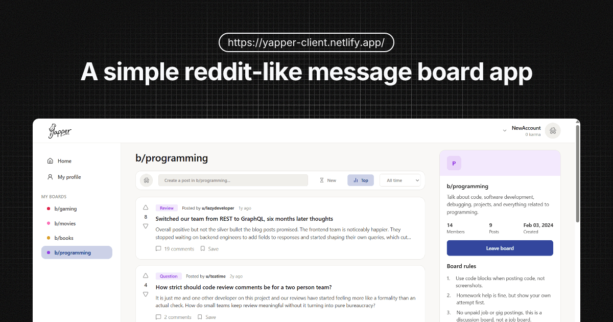

# Yapper

A full-stack, Reddit-inspired message board application where users can join communities, create posts, participate in threaded discussions, vote on content, and manage their accounts.

**Live Demo:** [Yapper](https://yapper-client.netlify.app/)



## Features

### Authentication

- Create an account and log in
- Session-based authentication
- Password hashing
- Persistent login sessions
- Update account username, email address, and password
- Delete an account while preserving its associated content

Deleted accounts are anonymized rather than completely removed from the database. This allows posts and comments to remain visible while removing the user's identifiable information.

### Boards

- Browse available message boards
- Search boards by name
- View board descriptions, statistics, and rules
- Join and leave boards
- View recent posts

### Posts

- Create posts within boards
- Choose from multiple post flairs:
  - PSA
  - News
  - Review
  - Discussion
  - Question

- View individual post pages
- Vote on posts
- Sort posts by recency or score
- Save posts for later

### Comments

- Create comments on posts
- Reply to existing comments
- Display threaded comment conversations
- Vote on comments

### User Profiles

- View user profiles
- View user statistics, including post count, comment count, karma, and joined boards
- Edit a profile bio
- View posts created by a user
- View saved posts

### Additional Features

- Light and dark themes
- Responsive desktop and mobile layouts
- Reusable custom React hooks
- Client-side routing
- Loading and error states
- Custom 404 pages
- Protected actions for authenticated users

## Tech Stack

### Frontend

- React
- TypeScript
- Vite
- React Router
- Tailwind CSS

### Backend

- Node.js
- Express
- PostgreSQL

### Key Libraries

- `express-session` — Session-based authentication
- `bcrypt` — Password hashing
- `validator` — Server-side input validation
- `cors` — Cross-origin request handling
- `lucide-react` — UI icons

## Architecture

The project is organized as separate client and server applications:

```text
yapper/
├── client/
│   ├── public/
│   └── src/
│       ├── assets/
│       ├── components/
│       ├── pages/
│       └── utils/
│
└── server/
    ├── sql/
    │   └── seed-data/
    └── src/
        ├── routes/
        └── utils/
```

The React frontend communicates with an Express REST API, which handles authentication, users, boards, posts, comments, votes, saved posts, and board memberships.

## Database

Yapper uses PostgreSQL with relational tables for:

- Users
- Boards
- Posts
- Comments
- Votes
- Board memberships
- Board rules
- Saved posts

Comments support threaded replies through a `parent_comment_id` relationship.

The database also uses constraints to help maintain data integrity, including preventing users from:

- Joining the same board multiple times
- Saving the same post multiple times
- Casting multiple votes on the same piece of content

## Getting Started

### 1. Clone the repository

```bash
git clone <repository-url>
cd yapper
```

### 2. Install dependencies

Install the frontend dependencies:

```bash
cd client
npm install
```

Install the backend dependencies:

```bash
cd ../server
npm install
```

### 3. Configure environment variables

Create a `.env` file inside the `server` directory:

```env
DATABASE_URL=your_postgresql_connection_string
SESSION_SECRET=your_session_secret
CLIENT_URL=http://localhost:5173
NODE_ENV=development
```

Create a `.env` file inside the `client` directory:

```env
VITE_API_URL=http://localhost:8000/api
```

### 4. Set up the database

Run the SQL schema and seed data located in:

```text
server/sql/
```

### 5. Start the development servers

Start the backend:

```bash
cd server
npm run dev
```

Start the frontend:

```bash
cd client
npm run dev
```

## Deployment

The frontend is deployed with Netlify, while the Express backend is deployed separately with Railway.

Because the frontend and backend run on different origins in production, the application is configured to handle:

- Cross-origin requests with credentials
- Secure cookies in production
- `SameSite=None` cookies for cross-origin sessions
- Environment-specific configuration

## Future Improvements

Potential future improvements include:

- Redis-backed session storage
- Pagination or infinite scrolling
- More advanced search and filtering
- Additional board moderation features
- Notifications
- Expanded profile customization

## What I Learned

Yapper was built as a full-stack portfolio project to practice designing, building, and deploying a complete web application.

Some of the areas explored during development include:

- Designing a relational PostgreSQL database
- Building a REST API with Express
- Implementing session-based authentication
- Password hashing and validation
- Managing authenticated user state in React
- Creating reusable custom React hooks
- Handling frontend state updates after API requests
- Building responsive layouts
- Working with relational SQL queries
- Deploying frontend and backend applications separately
- Configuring CORS and cross-origin cookies
- Managing environment variables across development and production

---

Built with React, TypeScript, Express, and PostgreSQL.
